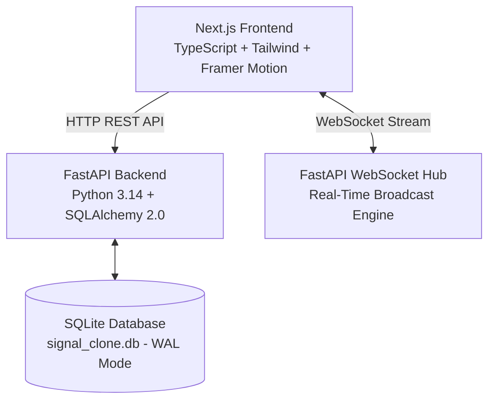
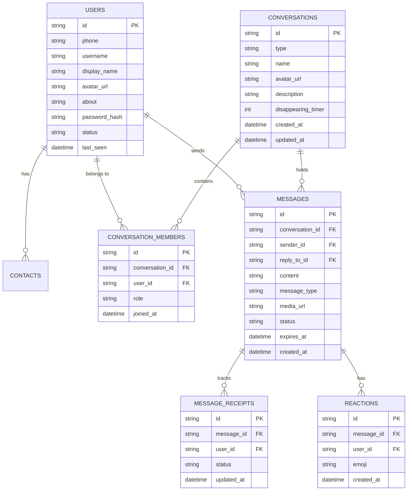

# Signal Messenger Clone (SDE Fullstack Project)

A pixel-perfect, high-performance web clone of **Signal Messenger** built with **Next.js 14/16 (TypeScript)**, **FastAPI**, **SQLite**, and **WebSockets**.

It replicates Signal's signature dark/light aesthetics, real-time end-to-end encrypted chat workflows, delivery/read receipts (double blue checkmarks), live typing indicators, group management, disappearing messages, emoji reactions, quoted replies, file attachments, and voice/video call simulation.

---

## 🌟 Key Features

1. **Authentic Signal UX & Aesthetics**:
   - Signature OLED Dark Mode (`#121212`, `#1F1F1F`, `#2C6BED` Signal Blue) and Light Mode.
   - Signal chat bubble layout, date dividers, and E2EE security notice banner.

2. **Real-Time WebSockets Engine**:
   - Bi-directional WebSockets broadcasting messages, typing status, read receipts, reactions, and online presence instantly across active connections.

3. **1-on-1 & Group Messaging**:
   - Real-time direct messaging between users.
   - Group creation wizard, member multi-select, admin badges, add/remove member controls, and system events.

4. **Message Status Pipeline & Receipts**:
   - `Sending` ➔ `Sent` (single check) ➔ `Delivered` (double check) ➔ `Read` (double blue checkmark).

5. **Disappearing Messages**:
   - Configurable self-destruct timers (5s, 10s, 30s, 1m, 1h, 1d, 1w) with animated timer countdown badges and automatic database purging.

6. **Interactive Features & Call Simulator**:
   - **Voice & Video Call Simulator**: Fullscreen video call modal with camera stream simulation, audio visualizer, mic mute, and end call controls.
   - **Safety Numbers & Key Verification**: Signal fingerprint matrix and QR code verification modal.
   - **Quick Demo User Switcher**: 1-click account swapper in the login modal and header dropdown to effortlessly test two-way WebSocket messaging.

---

## 🏗️ Architecture Overview



---

## 🗄️ Database Schema (SQLite)



---

## 🚀 Quick Start Guide

### Prerequisites
- Node.js v18+ and npm
- Python 3.10+

### 1. Run Backend (FastAPI + SQLite)
```bash
cd backend
python -m venv venv

# Windows
.\venv\Scripts\activate
# Linux/macOS
source venv/bin/activate

pip install -r requirements.txt

# Seed Database with sample users & messages
python seed.py

# Start FastAPI server
python -m uvicorn app.main:app --host 127.0.0.1 --port 8000 --reload
```
> FastAPI Swagger Docs available at: `http://127.0.0.1:8000/docs`

### 2. Run Frontend (Next.js)
```bash
cd frontend
npm install
npm run dev -- -p 3000
```
> Signal App available at: `http://localhost:3000`

---

## 🔑 Pre-seeded Demo Accounts

Use any of these pre-seeded accounts (OTP is fixed to `123456` or click the **1-Click Quick Demo Login** buttons):

| Display Name | Phone Number | Username | Bio |
| :--- | :--- | :--- | :--- |
| **Yuvraj** | `+919876543210` | `@yuvraj` | Privacy Enthusiast & Tech Lead 🛡️ |
| **Angel** | `+919876543211` | `@angel` | Building modern fullstack applications 🚀 |
| **Rio** | `+919876543212` | `@rio` | Signal UI & Encrypted Chat Advocate ✨ |

---

## 📡 API Reference Overview

### Auth & Users
- `POST /api/auth/phone-login`: Authenticate with phone & OTP.
- `POST /api/auth/register`: Register new user profile.
- `GET /api/auth/me`: Get current logged-in user details.
- `GET /api/auth/users`: List all demo users for quick switcher.
- `GET /api/users/contacts`: List user contacts.
- `POST /api/users/contacts`: Add contact by phone/username.

### Conversations & Messages
- `GET /api/conversations`: Get active chats sorted by timestamp.
- `POST /api/conversations`: Create direct chat or group conversation.
- `PUT /api/conversations/{id}/disappearing`: Update disappearing timer.
- `GET /api/conversations/{id}/messages`: Fetch message history.
- `POST /api/messages`: Send text/media message & trigger WS broadcast.
- `POST /api/messages/{id}/read`: Mark message as read (triggers double blue check receipt).
- `POST /api/messages/{id}/reactions`: Toggle emoji reaction.
- `POST /api/upload`: Upload image/file attachment.
- `WS /ws?token={jwt}`: WebSocket connection for live event streaming.
